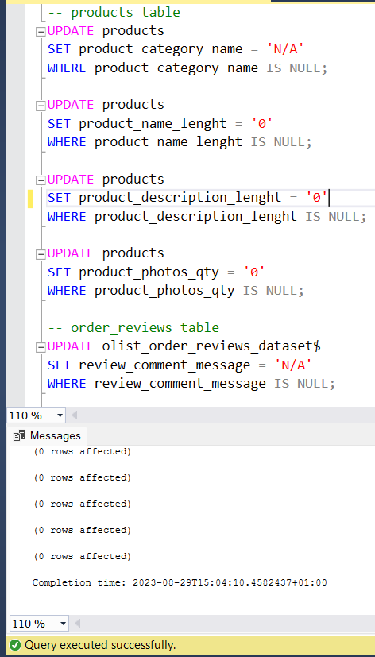
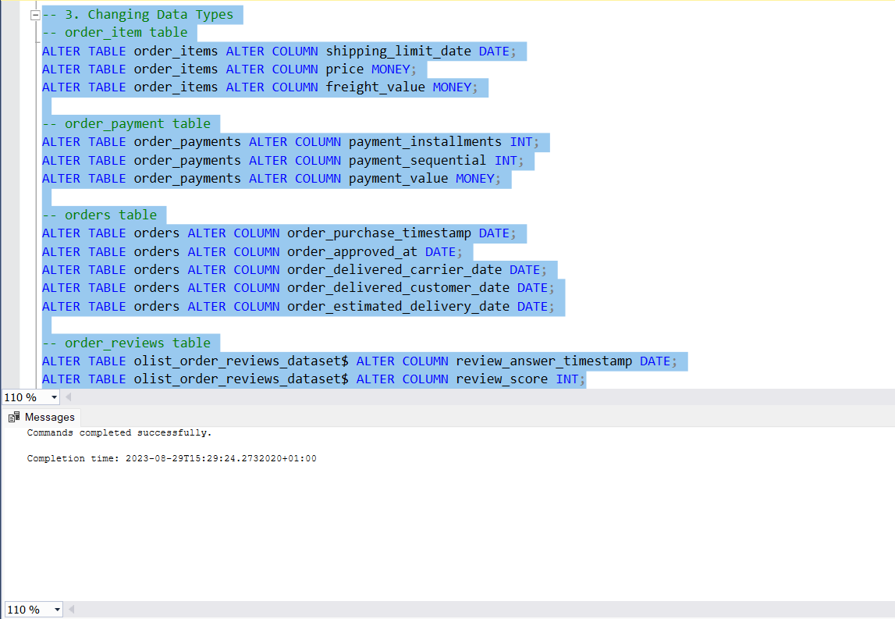
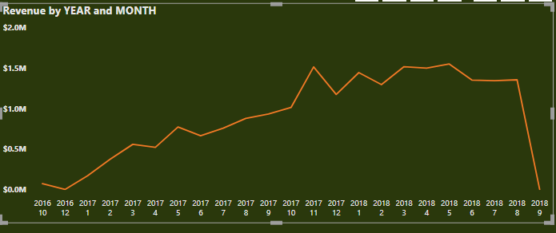
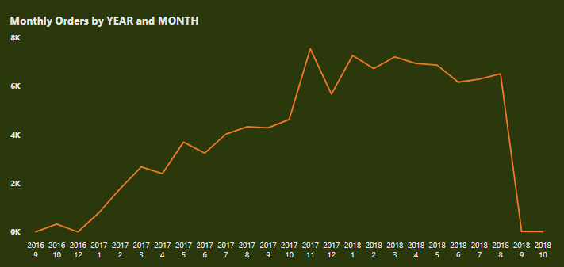
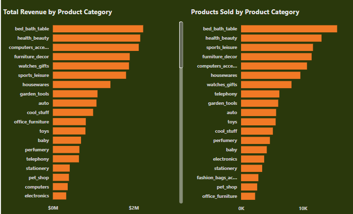
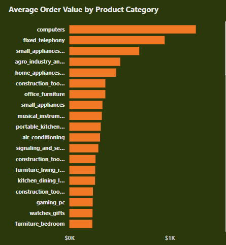
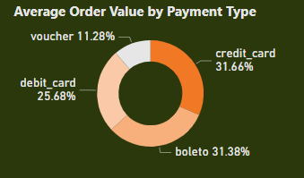
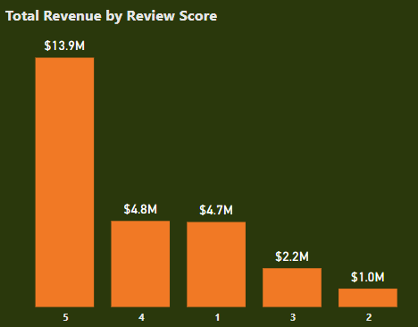
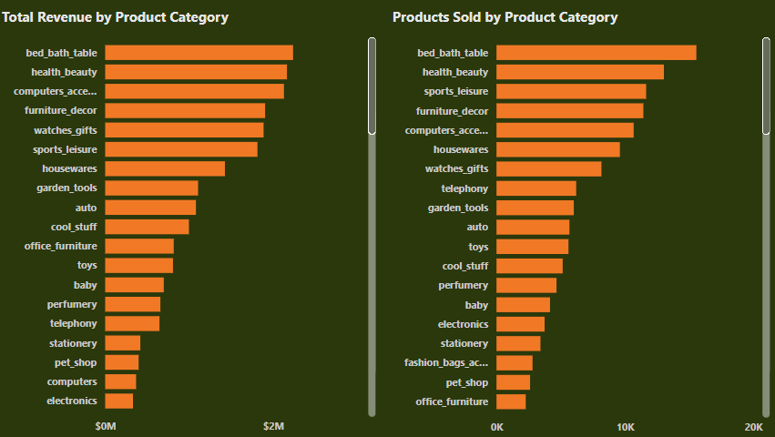

# Olist E-Commerce Data Analysis

## Introduction
I participated in a data challenge hosted by the Twitter data community in April. The assignment involved analyzing data from Olist, a well-known Brazilian e-commerce company. This dataset contained critical information regarding Olist's operations, such as product listings, sellers, and customer interactions. My goal was to look through the information and find helpful insights based on certain questions. The dataset was rigorously vetted and prepared by the challenge organizers to ensure that participants like me could extract important information and obtain insights related to Olist's company. This project challenge aims to accomplish the following objectives:
- To increase accuracy and usability, validate and sanitize the data.
- Analyze the data in order to answer the problem statement 
- Make recommendations to the Olist corporation.

## Dataset Description
This challenge's dataset was obtained from the KAGGLE website. You can access the dataset [here](https://www.kaggle.com/datasets/olistbr/brazilian-ecommerce) . It contains statistics on 100k orders placed on several Brazilian marketplaces between 2016 and 2018. The Olist dataset comprises nine separate datasets, all of which are stored in CSV format:

- olist_order_items_dataset
- olist_orders_dataset
- olist_order_payments_dataset
- olist_order_reviews_dataset
- olist_products_dataset
- olist_customers_dataset
- olist_sellers_dataset
- olist_geolocation_dataset
- olist_category_dataset

The olist [Data Dictionary](https://github.com/EmmanuelOrunta/Data-Challenge/blob/main/Olist%20Data%20Dictionary.pdf) provides a comprehensive overview of the dataset. This data dictionary is a useful resource because it includes detailed descriptions of each variable and its significance in the dataset. It is a great tool for properly analyzing and interpreting data.

## Outline Of This Challenge

- Data Cleaning, Data Validation
- Answer Business Questions and Perform Exploratory Data Analysis
- Share Insights and Make recommendations

### Data Cleaning and Data Validation
I explored the 9 different tables with Excel and from this process, I discovered the dataset had the following quality issues:

- **Null & Empty values**
  
  After checking for null values, there are 610 records with null values in the category, name_length, descriptn_len, and photos_qty columns of the products table.
I used the Update function to replace the null values in the category with N/A, and 0 with null values in the name_length, descriptn_len, and photos_qty columns.

- **Unwanted special characters and Proper Formatting**
  
  I replaced unwanted characters in the Geolocation table using the update/replace function, and I also capitalized the first letter of the geolocation city column to give the right formatting with the substring function

- **Wrong Data Types**

  I noticed this issue in some columns of the orders, payment, reviews, and items table and I addressed this issue by altering the the data types of the affected columns in the respective tables

  

- Updating of Column Names
  There are records in the category column that I had to update with English-translated versions of the Portuguese strings from the category_name_translatn table, but after confirming the distinct records from the translation table, I discovered three category records in the products table that I did not find in the translation table.
The first is pc_gamer, the second is portateis_cozinha_e_preparadores_de_alimentos, and the third is the Null entry from the products table.

## Exploratory Analysis and Answers to Business Problems
We will provide answers to the following business issues to help Olist obtain greater insights into its e-commerce platform and optimize available chances for growth:
1. What is the total revenue generated by Olist, and how has it changed over time?
2. How many orders were placed on Olist, and how does this vary by month or season?
3. What are the most popular product categories on Olist, and how do their sales volumes compare to each other?
4. What is the average order value (AOV) on Olist, and how does this vary by product category or payment method?
5. How many sellers are active on Olist, and how does this number change over time?
6. What is the distribution of seller ratings on Olist, and how does this impact sales performance?
7. How many customers have made repeated purchases on Olist, and what percentage of total sales do they account for?
8. What is the average customer rating for products sold on Olist, and how does this impact sales performance?
9. What is the average order cancellation rate on Olist, and how does this impact seller performance?
10. What are the top-selling products on Olist, and how have their sales trends changed over time?
11. Which payment methods are most commonly used by Olist customers, and how does this vary by product category or geographic region?
12. How do customer reviews and ratings affect sales and product performance on Olist?
13. Which product categories have the highest profit margins on Olist, and how can the company increase profitability across different categories?
14. Geolocation having high customer density. Calculate customer retention rate according to geolocations.

### Answers to Business Problems
1. What is the total revenue generated by Olist, and how has it changed over time?

The total revenue generated by Olist was approximately $20.7 million for two years. As time passes, revenue is on the rise from 2016 to 2017, peaking in the late quarter of November 2017 and going at an even rate in 2018. It did have its highest revenue in May of 2018

2. How many orders were placed on Olist, and how does this vary by month or season?

Over 99k+ orders were generated by Olist in this timeframe. There is a rise in the number of orders as the months pass by in 2017, with November bringing the most orders with over 7500+ orders, This could also be attributed due to the black friday effect, where there are lots of discounts, leading to the high demand of products

3. What are the most popular product categories on Olist, and how do their sales volumes compare to each other?

The most popular product category on Olist is "bed bath table," as they made the most orders and revenue, and we see a considerable decline in sales volume as we move from the most popular to the least popular categories. This drop in sales volume from the most popular to the least popular categories raises some concerns.

4. What is the average order value (AOV) on Olist, and how does this vary by product category or payment method?

On Olist, the average order value (AOV) across all orders is roughly $153.4. When payment methods were separated, voucher payments had the lowest AOV with credit card and boleto payments boasting the highest AOV. Furthermore, when the AOV was calculated by product category, PCs had the greatest AOV, followed by fixed telephony.

 product category             |   payment category
:----------------------------:|:------------------------: 
          |    

5. How many sellers are active on Olist, and how does this number change over time?

There were 3095 active sellers on Olist. The year with the most active sellers was 2018, with 2,383, followed by 1,784 in 2017, and 145 in 2016. On a general note, Olist saw a growth in the number of orders as the number of active sellers increased by the year, which also led to an increase in the number of products listed for sale on olist.

6. What is the distribution of seller ratings on Olist, and how does this impact sales performance?
  
It is possible to assume that merchants with review scores of 4 and 5 received the most orders, indicating positive sales success. Furthermore, vendors with higher review scores made greater total revenue, indicating a link between good feedback and increased sales. When the rating distribution is compared to the average order value (i.e. the average dollar a customer spends on an order on the Olist platform), the outcome is the opposite, with highly rated products having a lower average order value than low-ranked ones. This could imply that the lowest-rated products are the most expensive, where buyers haven't had positive experiences despite the company having a higher AOV. This circumstance implies that buyers choose less expensive products with higher ratings, and these customers spend more money on more expensive things on average.

Alternatively, the highly rated products may be in a more competitive market, resulting in lower prices and profit margins despite their larger sales volume. Even though the highly rated products had the most orders, the average order value would be lower in this instance.

7. How many customers have made repeated purchases on Olist, and what percentage of total sales do they account for?

A total of 2997 consumers have returned to make additional purchases. Furthermore, sales generated by repeat consumers account for only 6% of overall sales.

8. What is the average customer rating for products sold on Olist, and how does this impact sales performance?

The average customer rating for most products sold on olist was generally high with many products getting ratings of 4 and 5. The best-rated products had the best revenue gains and best sales for the 2-year period. A further visualization shown below will show the correlation between both variables.

 Product Sold                 |   Revenue generated
:----------------------------:|:------------------------: 
          |    

9. What is the average order cancellation rate on Olist, and how does this impact seller performance?

The average order cancellation rate on Olist is 0.63% (less than 1%), indicating that there is a high degree of customer satisfaction and that the Olist platform is generally efficient. Customers receive the things they bought, and there are seldom problems with the entire buying procedure. This could lead to enhanced client loyalty and a better overall reputation for the organization, but one major finding was a poor customer retention rate. Olist still has work to do in converting first-time customers into regular customers, as customers may have received better discounts from competitors or received better customer service from other organizations.

10. What are the top-selling products on Olist, and how have their sales trends changed over time?

The top selling products on Olist were Bed Bath Table, Computer Accessories, Health Beauty, Furniture Decor etc. With bed_bath_table generating the most revenue overall, computer accessories grew at the fastest pace in the first two years of operation. It is critical to highlight that this is a significant category with the highest average order value. To optimize profit and improve sales performance, Olist must offer strategic sales incentives such as volume discounts, cross-sell, and up-sell.

