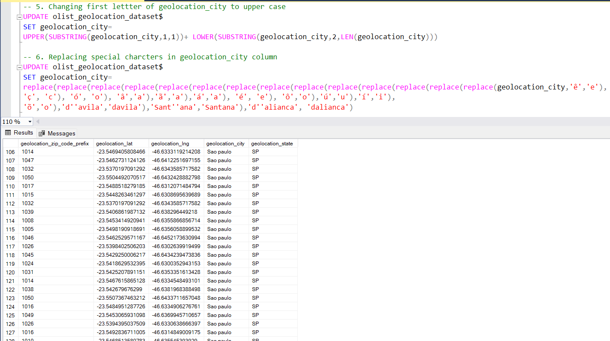
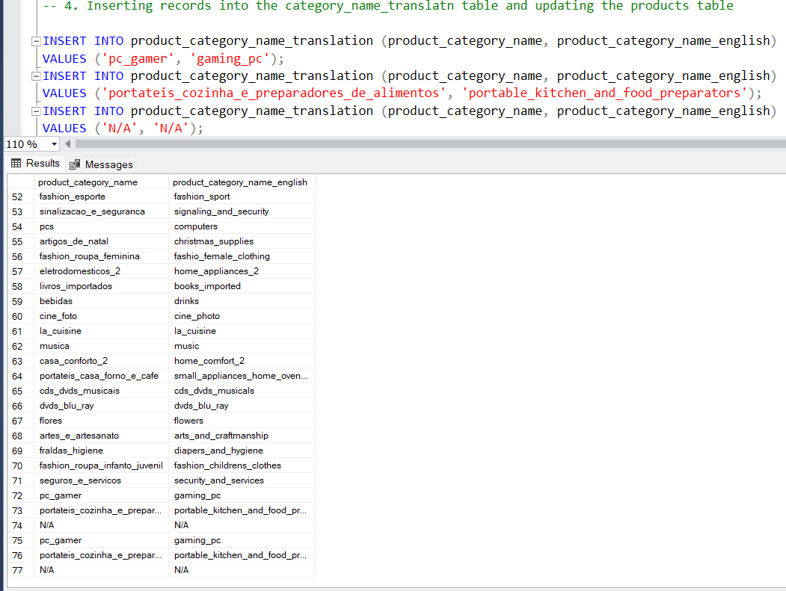

# Olist E-Commerce Data Analysis

## Introduction
I participated in a data challenge hosted by the Twitter data community in April. The assignment involved analyzing data from Olist, a well-known Brazilian e-commerce company. This dataset contained critical information regarding Olist's operations, such as product listings, sellers, and customer interactions. My goal was to look through the information and find helpful insights based on certain questions. The dataset was rigorously vetted and prepared by the challenge organizers to ensure that participants like me could extract important information and obtain insights related to Olist's company. This project challenge aims to accomplish the following objectives:
- To increase accuracy and usability, validate and sanitize the data.
- Analyze the data in order to answer the problem statement 
- Make recommendations to the Olist corporation.

## Dataset Description
This challenge's dataset was obtained from the KAGGLE website. You can access the dataset [here](https://www.kaggle.com/datasets/olistbr/brazilian-ecommerce) . It contains statistics on 100k orders placed on several Brazilian marketplaces between 2016 and 2018. The Olist dataset comprises nine separate datasets, all of which are stored in CSV format:

- olist_order_items_dataset
- olist_orders_dataset
- olist_order_payments_dataset
- olist_order_reviews_dataset
- olist_products_dataset
- olist_customers_dataset
- olist_sellers_dataset
- olist_geolocation_dataset
- olist_category_dataset

The olist [Data Dictionary](https://github.com/EmmanuelOrunta/Data-Challenge/blob/main/Olist%20Data%20Dictionary.pdf) provides a comprehensive overview of the dataset. This data dictionary is a useful resource because it includes detailed descriptions of each variable and its significance in the dataset. It is a great tool for properly analyzing and interpreting data.

## Outline Of This Challenge

- Data Cleaning, Data Validation
- Answer Business Questions and Perform Exploratory Data Analysis
- Share Insights and Make recommendations

### Data Cleaning and Data Validation
I explored the 9 different tables with Excel and from this process, I discovered the dataset had the following quality issues:

- **Null & Empty values**
  
  After checking for null values, there are 610 records with null values in the category, name_length, descriptn_len, and photos_qty columns of the products table.
I used the Update function to replace the null values in the category with N/A, and 0 with null values in the name_length, descriptn_len, and photos_qty columns.

- **Unwanted special characters and Proper Formatting**
  
  I replaced unwanted characters in the Geolocation table using the update/replace function, and I also capitalized the first letter of the geolocation city column to give the right formatting with the substring function

- **Wrong Data Types**

  I noticed this issue in some columns of the orders, payment, reviews, and items table and I addressed this issue by altering the the data types of the affected columns in the respective tables

  

- Updating of Column Names
  There are records in the category column that I had to update with English-translated versions of the Portuguese strings from the category_name_translatn table, but after confirming the distinct records from the translation table, I discovered three category records in the products table that I did not find in the translation table.
The first is pc_gamer, the second is portateis_cozinha_e_preparadores_de_alimentos, and the third is the Null entry from the products table.

## Exploratory Analysis and Answers to Business Problems
We will provide answers to the following business issues to help Olist obtain greater insights into its e-commerce platform and optimize available chances for growth:
1. What is the total revenue generated by Olist, and how has it changed over time?
2. How many orders were placed on Olist, and how does this vary by month or season?
3. What are the most popular product categories on Olist, and how do their sales volumes compare to each other?
4. What is the average order value (AOV) on Olist, and how does this vary by product category or payment method?
5. How many sellers are active on Olist, and how does this number change over time?
6. What is the distribution of seller ratings on Olist, and how does this impact sales performance?
7. How many customers have made repeated purchases on Olist, and what percentage of total sales do they account for?
8. What is the average customer rating for products sold on Olist, and how does this impact sales performance?
9. What is the average order cancellation rate on Olist, and how does this impact seller performance?
10. What are the top-selling products on Olist, and how have their sales trends changed over time?
11. Which payment methods are most commonly used by Olist customers, and how does this vary by product category or geographic region?
12. How do customer reviews and ratings affect sales and product performance on Olist?
13. Which product categories have the highest profit margins on Olist, and how can the company increase profitability across different categories?
14. Geolocation having high customer density. Calculate customer retention rate according to geolocations.

### Answers to Business Problems
1. What is the total revenue generated by Olist, and how has it changed over time?
The total revenue generated by Olist was approximately $20.7 million for 2 years. As time passes by, revenue is on a rise from 2016 to 2017, peaking in the late quarter of November 2017 and going at an even rate in 2018. It did have its highest revenue in May of 2018

